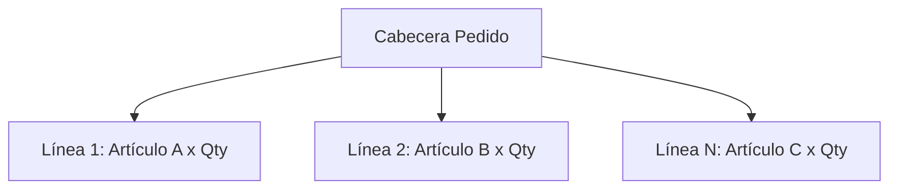
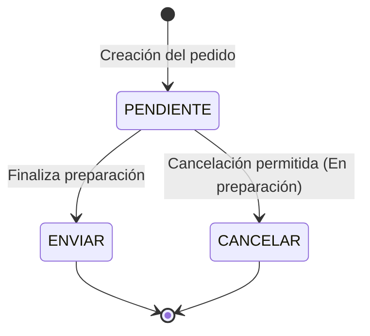
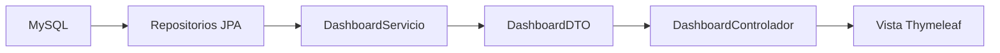
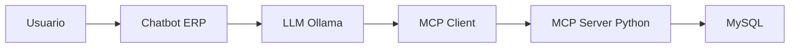

# 🏪 Tienda ORCA - Especificación del Sistema ERP (Rama: chatbot)

Este documento centraliza las reglas de negocio, flujos y arquitectura de datos del ERP para asegurar la consistencia del código y facilitar el entrenamiento del contexto de Inteligencia Artificial (LLM/MCP).

---

## 🏗️ 1. Módulos Core (Estructura CRUD)

### 📦 Módulo de Artículos
*   **Operaciones:** CRUD Completo (Crear, Leer, Actualizar, Eliminar).
*   **Regla de negocio para Eliminación:** Las bajas se procesan como un cambio de estado a **CANCELAR** (Baja lógica) para preservar la integridad referencial en el histórico de pedidos.

### 👥 Módulo de Clientes
*   **Operaciones:** CRUD Completo.
*   **Tipos de Cliente y Reglas Comerciales:**
    1.  **Estándar:** Tarifas base sin condiciones especiales.
    2.  **Premium:** 
        *   Sujeto al pago de una **cuota anual**.
        *   Aplica un **30% de descuento automático** en todas las líneas de pedido elegibles.

---

## 🧾 2. Módulo de Pedidos (Arquitectura Maestro-Detalle)

Un pedido se compone de una **Cabecera** (datos globales, cliente, fecha, estado) y **$N$ Líneas de Pedido** (artículos, cantidades, precios unitarios con descuento aplicado).



### 🔄 Ciclo de Vida y Estados del Pedido

El sistema restringe las acciones de los usuarios y del chatbot en base a tres estados secuenciales estrictos:



1.  **PENDIENTE**
    *   *Definición:* El pedido está en proceso de picking/preparación en el almacén.
    *   *Restricción:* **No se puede enviar** hasta que todo el stock esté consolidado y la preparación finalice.
2.  **ENVIAR**
    *   *Definición:* Pedido preparado y listo para su distribución logística.
3.  **CANCELAR**
    *   *Restricción crítica:* **Solo está permitido cancelar un pedido mientras esté en estado PENDIENTE** (durante el tiempo de preparación). Una vez transicionado a ENVIAR, el sistema bloquea la cancelación.

---

## 🤖 3. Integración con el Contexto de IA (Prompt Injection)

Para que el modelo local de la aplicación procese estas reglas sin consultar la base de datos relacional en cada interacción, la variable `CONTEXTO` del controlador mapea directamente estas definiciones:

```java
private final String CONTEXTO = """
    Eres el asistente del ERP de Tienda ORCA. Reglas estrictas:
    1. Artículos/Clientes tienen CRUD (Borrado de artículo = CANCELAR).
    2. Clientes Premium pagan cuota anual y tienen 30% de descuento fijo.
    3. Pedidos tienen Cabecera y N líneas.
    4. Estados de pedido obligatorios:
       - PENDIENTE: En preparación. No se puede enviar aún. Cancelación PERMITIDA.
       - ENVIAR: Listo. Cancelación PROHIBIDA.
       - CANCELAR: Pedido anulado.
    """;
```
## 📊 4. Módulo Dashboard ERP

El Dashboard proporciona una vista ejecutiva en tiempo real del estado del negocio utilizando datos agregados de la base de datos MySQL.

### Indicadores principales (KPIs)

El sistema calcula y muestra:

| Indicador          | Descripción                                  |
| ------------------ | -------------------------------------------- |
| Total Artículos    | Número total de artículos registrados        |
| Pedidos Pendientes | Pedidos en estado PENDIENTE                  |
| Pedidos Enviados   | Pedidos en estado ENVIAR                     |
| Pedidos Hoy        | Pedidos generados durante el día actual      |
| Ingresos Totales   | Suma acumulada de ventas históricas          |
| Ingresos Hoy       | Facturación generada durante la fecha actual |

### Arquitectura



### Objetivo futuro

Implementar gráficos dinámicos mediante Chart.js para representar:

* Ventas de los últimos 7 días.
* Evolución de ingresos.
* Pedidos por estado.
* Clientes nuevos por periodo.

### DTO Principal

DashboardDTO centraliza todos los indicadores calculados para la vista.

Actualmente incluye:

* totalArticulos
* pedidosPendientes
* pedidosEnviados
* pedidosHoy
* ingresosTotales
* ingresosHoy
* ventasUltimos7Dias

### Restricciones

* El Dashboard es únicamente informativo.
* No permite modificaciones directas sobre entidades.
* Todas las métricas deben calcularse desde los repositorios JPA.

## 🤖 5. Arquitectura LLM + MCP

El ERP incorpora un asistente basado en modelos de lenguaje locales ejecutados mediante Ollama.

### Modelo actual

```text
llama3.2:1b
```

Configuración principal:

```properties
spring.ai.ollama.base-url=http://localhost:11434
spring.ai.ollama.chat.options.model=llama3.2:1b
spring.ai.ollama.chat.options.temperature=0.3
```

### Objetivo del asistente

Permitir consultas en lenguaje natural sobre:

* Artículos.
* Clientes.
* Pedidos.
* Reglas de negocio.
* Métricas del Dashboard.

Ejemplos:

* "¿Cuántos pedidos pendientes existen?"
* "¿Qué descuento tiene un cliente Premium?"
* "¿Cuántos artículos hay registrados?"

### MCP (Model Context Protocol)

El proyecto incluye una integración experimental con MCP para permitir que el LLM invoque herramientas externas.

Arquitectura prevista:



### Estado actual

| Componente        | Estado                  |
| ----------------- | ----------------------- |
| Ollama            | Operativo               |
| Spring AI         | Operativo               |
| Chat ERP          | Operativo               |
| Dashboard         | Operativo               |
| MCP Client        | En pruebas              |
| MCP Server Python | Arranca correctamente   |
| Tool Discovery    | Pendiente de validación |

### Objetivo final

Permitir consultas directas sobre la base de datos mediante herramientas MCP.

Ejemplos previstos:

* "Muéstrame los últimos pedidos."
* "¿Qué clientes Premium existen?"
* "¿Cuánto se ha facturado hoy?"
* "Genera un resumen del Dashboard."

El modelo nunca debe modificar datos sin confirmación explícita del usuario.
