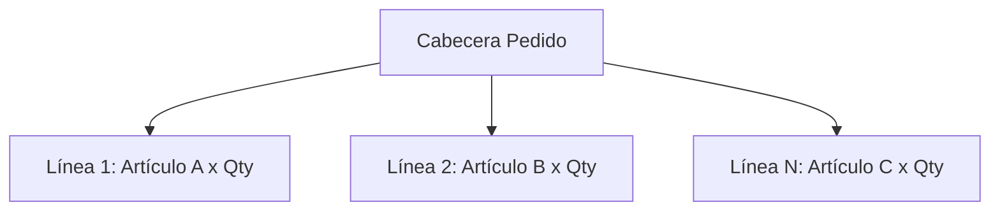
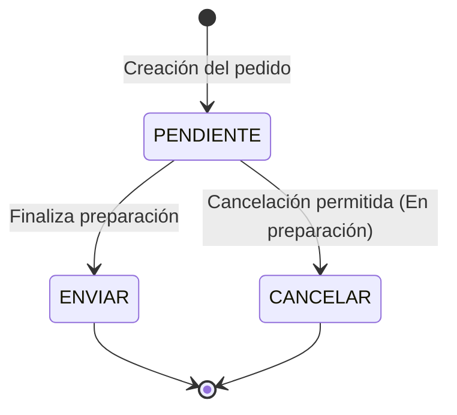

# 🏪 Tienda ORCA - Especificación del Sistema ERP (Rama: chatbot)

Este documento centraliza las reglas de negocio, flujos y arquitectura de datos del ERP para asegurar la consistencia del código y facilitar el entrenamiento del contexto de Inteligencia Artificial (LLM/MCP).

---

## 🏗️ 1. Módulos Core (Estructura CRUD)

### 📦 Módulo de Artículos
*   **Operaciones:** CRUD Completo (Crear, Leer, Actualizar, Eliminar).
*   **Regla de negocio para Eliminación:** Las bajas se procesan como un cambio de estado a **CANCELAR** (Baja lógica) para preservar la integridad referencial en el histórico de pedidos.

### 👥 Módulo de Clientes
*   **Operaciones:** CRUD Completo.
*   **Tipos de Cliente y Reglas Comerciales:**
    1.  **Estándar:** Tarifas base sin condiciones especiales.
    2.  **Premium:** 
        *   Sujeto al pago de una **cuota anual**.
        *   Aplica un **30% de descuento automático** en todas las líneas de pedido elegibles.

---

## 🧾 2. Módulo de Pedidos (Arquitectura Maestro-Detalle)

Un pedido se compone de una **Cabecera** (datos globales, cliente, fecha, estado) y **$N$ Líneas de Pedido** (artículos, cantidades, precios unitarios con descuento aplicado).



### 🔄 Ciclo de Vida y Estados del Pedido

El sistema restringe las acciones de los usuarios y del chatbot en base a tres estados secuenciales estrictos:



1.  **PENDIENTE**
    *   *Definición:* El pedido está en proceso de picking/preparación en el almacén.
    *   *Restricción:* **No se puede enviar** hasta que todo el stock esté consolidado y la preparación finalice.
2.  **ENVIAR**
    *   *Definición:* Pedido preparado y listo para su distribución logística.
3.  **CANCELAR**
    *   *Restricción crítica:* **Solo está permitido cancelar un pedido mientras esté en estado PENDIENTE** (durante el tiempo de preparación). Una vez transicionado a ENVIAR, el sistema bloquea la cancelación.

---

## 🤖 3. Integración con el Contexto de IA (Prompt Injection)

Para que el modelo local de la aplicación procese estas reglas sin consultar la base de datos relacional en cada interacción, la variable `CONTEXTO` del controlador mapea directamente estas definiciones:

```java
private final String CONTEXTO = """
    Eres el asistente del ERP de Tienda ORCA. Reglas estrictas:
    1. Artículos/Clientes tienen CRUD (Borrado de artículo = CANCELAR).
    2. Clientes Premium pagan cuota anual y tienen 30% de descuento fijo.
    3. Pedidos tienen Cabecera y N líneas.
    4. Estados de pedido obligatorios:
       - PENDIENTE: En preparación. No se puede enviar aún. Cancelación PERMITIDA.
       - ENVIAR: Listo. Cancelación PROHIBIDA.
       - CANCELAR: Pedido anulado.
    """;
```
